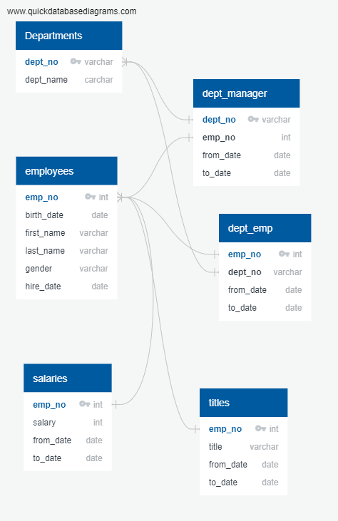

# Pewlett_Hackard_Analysis
Employee Database with SQL

### Challenge

### Technical Report

Pewlett Hackhard (PH) is a large company with thousands of employees and has been around for a long time. As the baby boomer generation begins to retire, PH is planning around this generational event in two ways. It's planning to offer retirement packages for those eligible, and secondly, it needs to consider the roles and responsibilities left vacant by those retiring. Having the foresight to see this, and conducting the analysis to diagnose the extent and quantitative reach of this event will allow PH to properly plan for and execute the necessary action items. The main questions to be answered in the ananlysis, are who will be retiring and how many, by title, department, and other variables.

Companies, especially older companies use a combination of excel to store their data dn SQL to query or "ask questions" of the information contained in the data. We began by creating an Entity Relationship Diagram to establish the types of data available to us, which data was stored in which tables and how the tables related to each other in the form of primary and foreign keys. The diagram created is shown above. Once this diagram was created it became easy to create tables in SQL according to these relationships and import the tables in fromt the CSV files to create a database we could work with. Wwe then queried the data by birth dates to do an exploratory analysis of the retirement age employees. We found the number to be quite large, so we created new tables to store this information. After this we joined tables such as the titles, salaries and deparment employees tables with the retirement employees table to describe these employees better. We noticed some employees held multiple titles so we had to account for that. We saw that some employees no longer worked at the firm, so we accounted for that. In the end we created new tables within our database contained the information we wanted and performed basic analysis on these tables.

Through our analysis, we found that almost a third of employees across job titles are eligible for retirement packages! This is a massive number of employees that need to be accounted for, so it's good that we did this analysis. To do this we found the employees eligible for retirement by job title and compared that to the totaly employees grouped by job title. We also found that there are plenty of yougner employees a decade away from retirement that are eligible for the mentorship program. This is important because these employees can be intstrumental through the mentorship program to educate and integreate new hires into the company. Through this analysis we've conlcuded that PH has a lot of work to do in preparing for the retirement of baby boomers and they have plenty of resources to help make that process smoother. The next step I would recommened to figure out the cost of retirement packes to be offered to retirement age employees. I would also project the number of new hires needed and the cost of onboarding them. Given that managers are retiring, it's also important to promote employees to fill those positions as well.
